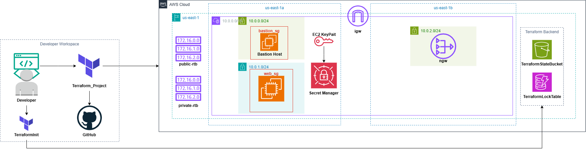

# Terraform AWS Infrastructure — Secure Modular Foundation

[](https://www.terraform.io/) [](https://aws.amazon.com/) [](LICENSE)

## Project Overview

**Goal:** Automate a secure, modular AWS infrastructure for a multi-tier web application. This codebase creates a VPC with public and private subnets, a bastion host for administrative access, NAT Gateway(s), and private web servers. State is stored remotely in S3 with DynamoDB locking.

**Audience:** Senior DevOps / Cloud Engineers. The README focuses on operational details, deployment steps, and security considerations.

**Architecture Diagram**

- Placeholder: add your diagram file `AWSCloudInfrastructure.png` (or `Terraform_Project/aws-architecture.png`) and link it here:

  

## Infrastructure Components

- **Module: `vpc`** — Creates the VPC, public/private subnets, Internet Gateway, NAT Gateway, and route tables. Current implementation uses two AZ variables; recommended: extend to multi-AZ arrays.
- **Module: `security`** — Creates Security Groups (bastion and web), generates an SSH key pair, uploads the private key to AWS Secrets Manager. Outputs SG IDs and `key_name`.
- **Module: `ec2`** — Provisions EC2 instances (bastion and web). Uses a canonical Ubuntu AMI via a `data "aws_ami"` lookup.
- **Backend (TerraformInit)** — Contains reusable resources to create the S3 bucket and DynamoDB table used for remote state and locks.

## Prerequisites

- AWS account with appropriate IAM permissions to create S3, DynamoDB, EC2, VPC, Secrets Manager, IAM, and KMS resources.
- AWS CLI configured locally (`aws configure`) or environment variables set: `AWS_ACCESS_KEY_ID`, `AWS_SECRET_ACCESS_KEY`, `AWS_DEFAULT_REGION`.
- Terraform installed (recommended >= 1.5). Verify:

```bash
terraform -version
```

- Create the remote state backend (S3 bucket + DynamoDB table) before running the main workspace. Use the included helper in `TerraformInit`:

```bash
cd TerraformInit
terraform init
terraform apply -auto-approve
```

After the backend bucket and lock table exist, initialize the main project.

## Project Structure

```
Terraform/
├─ TerraformInit/                # Backend helper: creates S3 + DynamoDB
│  ├─ main.tf
│  ├─ provider.tf
│  └─ terraform.tfstate*
├─ Terraform_Project/            # Primary infrastructure code
│  ├─ backend.tf                 # S3 backend config
│  ├─ provider.tf
│  ├─ main.tf                    # Module wiring: vpc, security, ec2
│  ├─ variables.tf
│  └─ modules/
│     ├─ vpc/
│     │  ├─ main.tf
│     │  ├─ variables.tf
│     │  └─ outputs.tf
│     ├─ security/
│     │  ├─ main.tf
│     │  ├─ variables.tf
│     │  └─ outputs.tf
│     └─ ec2/
│        ├─ main.tf
│        └─ data.tf
```

## Deployment Guide

This project supports environment-specific variables. You can use `-var-file` or Terraform workspaces to separate Staging/Prod.

1. Create backend resources (if not already created):

```bash
cd Terraform/TerraformInit
terraform init
terraform apply -auto-approve
```

2. Initialize the main workspace (points to the S3 backend defined in `backend.tf`):

```bash
cd Terraform/Terraform_Project
terraform init
```

3. Example: deploy to Staging with a variable file:

```bash
terraform plan -var-file=env/staging.tfvars -out=staging.plan
terraform apply "staging.plan"
```

4. For Production, repeat with `env/prod.tfvars` (use stricter CIDR ranges, multi-AZ, and separate KMS keys).

Notes:
- Keep the bucket name and DynamoDB table configured in `backend.tf` consistent with what `TerraformInit` created.
- Consider using Terraform Cloud or remote CI pipelines for plan/apply with enforced policies.

## Security Features and Recommendations

- **SSH Key Management:** The `security` module generates an RSA key and stores the **private key** in AWS Secrets Manager (`aws_secretsmanager_secret`). This is a valid pattern when the secret is encrypted with a customer-managed KMS key and access is restricted by IAM. Recommended hardening:
  - Use a customer-managed KMS key and restrict Secrets Manager access to a small set of principals.
  - Enable rotation if applicable and audit access using CloudTrail.
  - Prefer AWS Systems Manager (SSM) Session Manager for bastionless access; avoid wide distribution of private keys.

- **Bastion Host:** The bastion host sits in a public subnet and is intended for admin SSH jump-host access into private web instances. Current implementation allows SSH from `0.0.0.0/0` — this should be replaced with a restricted admin CIDR (`var.admin_cidr`) or removed in favor of Session Manager.

- **Security Groups:** The web Security Group only allows SSH from the bastion SG (good segmentation). Harden further by allowing only necessary application ports (e.g., 80/443) from known sources and limit egress where feasible.

- **IAM & Least Privilege:** EC2 instances should have instance profiles with least-privilege IAM roles (for SSM, CloudWatch, S3 access if needed). The current code does not attach instance profiles — add `aws_iam_role`, `aws_iam_policy`, and `aws_iam_instance_profile` resources for production.

## Reliability & AMI selection

- The `ec2` module uses a canonical Ubuntu AMI data source with `most_recent = true`. This is convenient but can introduce unexpected AMI changes. For production, consider pinning to a release or maintain a curated AMI pipeline.

## Variables (Key inputs)

| Variable | Type | Description | Default |
|---|---:|---|---:|
| `vpc_cidr` | string | CIDR block for the VPC | n/a |
| `bastion_public_subnet_cidr` | string | CIDR for bastion public subnet | n/a |
| `public_subnet_cidr` | string | CIDR for public subnet (NAT) | n/a |
| `private_subnet_cidr` | string | CIDR for private subnet (web) | n/a |
| `instance_type` | string | EC2 instance type for hosts | n/a |

## Outputs (Key values)

| Output | Description |
|---|---|
| `vpc_id` | The ID of the created VPC |
| `bastion_public_subnet_id` | Subnet ID for the bastion host |
| `public_subnet_id` | Subnet ID for NAT/ingress components |
| `private_subnet_id` | Subnet ID for private web servers |
| `bastion_sg_id` | Security Group ID for bastion |
| `web_sg_id` | Security Group ID for web servers |
| `key_name` | Name of the EC2 key pair created in AWS |

## Operational Recommendations

1. **Restrict SSH ingress** — replace `0.0.0.0/0` with `var.admin_cidr` or adopt SSM.
2. **Add IAM instance profiles** for SSM and required services; attach to EC2 instances.
3. **Apply consistent tags** across resources: implement a `var.tags` map applied via `locals.common_tags`.
4. **Multi-AZ HA** — expand subnets to an `azs` list and create NAT Gateway per AZ or leverage NAT autoscaling for resilience.
5. **Pin or manage AMI selection** — the `data "aws_ami"` uses `most_recent = true`; consider pinning to a release channel or use an allowlist to control unexpected changes.

## Troubleshooting

- If `terraform init` fails with backend errors, verify the S3 bucket exists and the credentials used have `s3:GetObject`/`s3:PutObject` and `dynamodb:*` permissions for the lock table.
- Secrets Manager access: ensure the IAM user/role performing `terraform apply` has permission to pass/modify the KMS key used to encrypt the secret (if a CMK is used).

---

If you'd like, I can now implement the quick security fixes (restrict bastion CIDR, add `var.tags`, and attach a minimal SSM IAM role to EC2), or create a patch that converts the VPC to multi-AZ and adds an ASG + ALB scaffold.
# Terraform-Project
