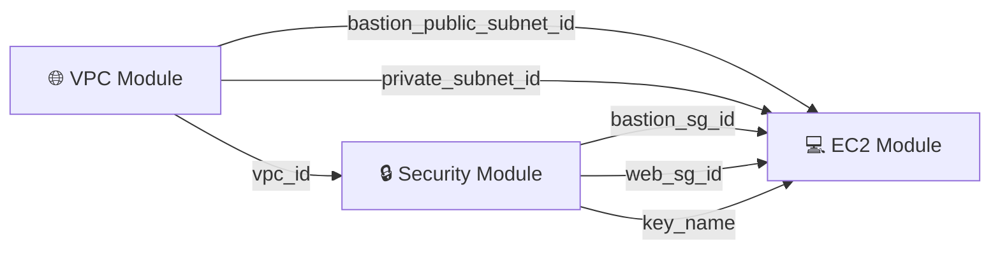

<p align="center">
  
  
  
  
</p>

<h1 align="center">🏗️ Secure Modular AWS Infrastructure</h1>

<p align="center">
  <b>A production-grade, modular Terraform project that provisions a hardened AWS network topology with Bastion Host access, private subnet isolation, NAT Gateway routing, and automated secrets management.</b>
</p>

---

## 📐 Architecture Diagram

<p align="center">
  
</p>

> The diagram above illustrates the complete data flow: internet traffic enters through the **Internet Gateway**, the **Bastion Host** acts as the sole SSH entry point in a dedicated public subnet, the **NAT Gateway** provides outbound-only internet access for private resources, and the **Apache Web Server** is fully isolated in a private subnet with no direct public exposure.

---

## 🧠 Why This Architecture Is Robust

This project is not just "Terraform that works" — it's an architecture built on **defense-in-depth** principles. Here's what makes it production-worthy:

### 🔐 Bastion Host as a Security Chokepoint

The Bastion Host is deployed in its own **dedicated public subnet** (`10.0.0.0/24`) and is the _only_ resource in the entire infrastructure with a public IP address exposed to SSH. This means:

- **Single point of audit** — all SSH sessions to internal servers are funneled through one host, making logging and monitoring trivial.
- **Reduced attack surface** — the private web server has _zero_ internet-facing ports. Its security group (`web_sg`) only permits SSH from the Bastion's security group ID, not from any CIDR block.
- **Kill-switch capability** — if a breach is suspected, terminating the Bastion instance immediately severs all external access to the private subnet.

### 🏰 Private Subnet Isolation

The Apache web server lives in a **private subnet** (`10.0.2.0/24`) with:

- **No public IP** — `map_public_ip_on_launch` is intentionally left as `false`.
- **No inbound internet route** — the private route table directs `0.0.0.0/0` traffic to the **NAT Gateway** (outbound only), not the Internet Gateway.
- **Security-group-level micro-segmentation** — inbound SSH is locked to the Bastion Host's security group, enforcing identity-based access rather than IP-based access.

### 🌐 NAT Gateway for Controlled Egress

The NAT Gateway sits in its own public subnet (`10.0.1.0/24`) and serves a critical role:

- Allows the private Apache server to pull **OS updates**, **packages**, and **patches** without being directly exposed to the internet.
- Uses an **Elastic IP** for a stable, whitelistable outbound address.
- Depends explicitly on the Internet Gateway (`depends_on`), ensuring correct provisioning order.

### 🔑 Zero-Trust Secrets Management

SSH keys are **never written to disk** or committed to version control:

- A **TLS private key** is generated at `terraform apply` time.
- The public key is registered as an **AWS Key Pair**.
- The private key is stored securely in **AWS Secrets Manager**, retrievable only by authorized IAM roles.

---

## 🗂️ Project Structure

```
Terraform/
│
├── AWSCloudInfrastructure.png          # Architecture diagram
├── README.md                           # This file
├── .gitignore                          # Ignores .terraform, state, keys, tfvars
│
├── TerraformInit/                      # 🔧 Bootstrap: Remote Backend Setup
│   ├── provider.tf                     #    AWS provider config (us-east-1)
│   └── main.tf                         #    S3 bucket + DynamoDB lock table
│
└── Terraform_Project/                  # 🏗️ Main Infrastructure
    ├── provider.tf                     #    AWS provider (hashicorp/aws ~> 6.0)
    ├── backend.tf                      #    S3 remote state + DynamoDB locking
    ├── variables.tf                    #    Root-level variable declarations
    ├── terraform.tfvars                #    Variable values (gitignored)
    ├── main.tf                         #    Module orchestration (VPC → Security → EC2)
    │
    └── modules/
        ├── vpc/                        #    Network topology
        │   ├── main.tf                 #    VPC, Subnets, IGW, NAT GW, Route Tables
        │   ├── variables.tf            #    CIDR blocks, availability zones
        │   └── outputs.tf             #    vpc_id, subnet IDs
        │
        ├── security/                   #    Security perimeter
        │   ├── main.tf                 #    Security Groups, Key Pair, Secrets Manager
        │   ├── variables.tf            #    vpc_id
        │   └── outputs.tf             #    SG IDs, key_name
        │
        └── ec2/                        #    Compute instances
            ├── data.tf                 #    Latest Ubuntu 22.04 AMI lookup
            ├── main.tf                 #    Bastion Host + Apache Server instances
            ├── variables.tf            #    SG IDs, subnet IDs, instance type, key
            └── outputs.tf             #    (extensible)
```

---

## 🔗 Module Dependency Flow

The modules are designed with a clear **dependency chain** where outputs from upstream modules feed directly into downstream modules:



| Source Module | Output | Consuming Module | Input |
|:---|:---|:---|:---|
| `vpc` | `vpc_id` | `security` | `vpc_id` |
| `vpc` | `bastion_public_subnet_id` | `ec2` | `bastion_subnet_id` |
| `vpc` | `private_subnet_id` | `ec2` | `web_subnet_id` |
| `security` | `bastion_sg_id` | `ec2` | `bastion_sg_id` |
| `security` | `web_sg_id` | `ec2` | `web_sg_id` |
| `security` | `key_name` | `ec2` | `key_name` |

---

## 📦 Module Deep-Dive

### 1. VPC Module — `modules/vpc/`

> **Role in the Big Picture:** The VPC module is the **foundation of the entire infrastructure**. It defines the network boundary, carves out isolated subnets, and establishes the routing rules that enforce the public/private separation. Every other module depends on it.

#### Resources Created

| Resource | Purpose |
|:---|:---|
| `aws_vpc` | Main VPC (`10.0.0.0/16`) with DNS hostnames enabled |
| `aws_subnet` (×3) | Bastion public (`/24`), NAT public (`/24`), Private (`/24`) |
| `aws_internet_gateway` | Provides internet access for public subnets |
| `aws_eip` + `aws_nat_gateway` | Stable outbound internet for private subnet |
| `aws_route_table` (×2) | Public routes → IGW, Private routes → NAT GW |
| `aws_route_table_association` (×3) | Binds subnets to their respective route tables |

#### Inputs

| Variable | Type | Description |
|:---|:---|:---|
| `vpc_cidr` | `string` | CIDR block for the VPC (e.g., `10.0.0.0/16`) |
| `bastion_public_subnet_cidr` | `string` | CIDR for the Bastion Host's public subnet |
| `public_subnet_cidr` | `string` | CIDR for the NAT Gateway's public subnet |
| `private_subnet_cidr` | `string` | CIDR for the private application subnet |
| `az1` | `string` | Availability zone 1 (default: `us-east-1a`) |
| `az2` | `string` | Availability zone 2 (default: `us-east-1b`) |

#### Outputs

| Output | Description |
|:---|:---|
| `vpc_id` | The VPC identifier — consumed by the Security module |
| `bastion_public_subnet_id` | Subnet for the Bastion Host — consumed by EC2 |
| `public_subnet_id` | Subnet hosting the NAT Gateway |
| `private_subnet_id` | Subnet for the Apache server — consumed by EC2 |

---

### 2. Security Module — `modules/security/`

> **Role in the Big Picture:** The Security module creates the **entire trust boundary** for compute resources. It defines who can talk to whom via security groups, generates ephemeral SSH keys, and stores them in AWS Secrets Manager — ensuring keys are never exposed in state files, logs, or code.

#### Resources Created

| Resource | Purpose |
|:---|:---|
| `aws_security_group` — `bastion_sg` | Allows SSH (port 22) from `0.0.0.0/0` — internet-facing |
| `aws_security_group` — `web_sg` | Allows SSH **only** from `bastion_sg` — no public access |
| `tls_private_key` | Generates an RSA key pair at apply time |
| `aws_key_pair` | Registers the public key with AWS as `ssh-key` |
| `aws_secretsmanager_secret` + `version` | Stores the private key PEM in Secrets Manager |

#### Inputs

| Variable | Type | Description |
|:---|:---|:---|
| `vpc_id` | `string` | The VPC in which security groups are created |

#### Outputs

| Output | Description |
|:---|:---|
| `bastion_sg_id` | Security group for the Bastion Host |
| `web_sg_id` | Security group for the private Apache server |
| `key_name` | The registered AWS key pair name (`ssh-key`) |

---

### 3. EC2 Module — `modules/ec2/`

> **Role in the Big Picture:** The EC2 module is the **consumer of all upstream outputs**. It provisions the actual compute instances, placing them into the correct subnets with the correct security groups and SSH keys. It uses a **data source** to dynamically fetch the latest Ubuntu 22.04 LTS AMI, ensuring instances are always patched.

#### Resources Created

| Resource | Purpose |
|:---|:---|
| `data.aws_ami` | Fetches the latest Ubuntu 22.04 HVM AMI from Canonical |
| `aws_instance` — `bastion_host` | Jump box in the Bastion public subnet |
| `aws_instance` — `apache_server` | Application server in the private subnet |

#### Inputs

| Variable | Type | Description |
|:---|:---|:---|
| `bastion_sg_id` | `string` | Security group for the Bastion Host |
| `web_sg_id` | `string` | Security group for the Apache server |
| `instance_type` | `string` | EC2 instance type (e.g., `t3.micro`) |
| `bastion_subnet_id` | `string` | Public subnet for the Bastion Host |
| `web_subnet_id` | `string` | Private subnet for the Apache server |
| `key_name` | `string` | SSH key pair name |

#### Outputs

_Currently extensible_ — the `outputs.tf` is a placeholder ready for `bastion_public_ip`, `web_private_ip`, etc.

---

## 🔑 SSH Access Protocol

> **This is a critical security procedure.** The private Apache server is **not accessible from the internet**. The only way to reach it is through the Bastion Host using **SSH Agent Forwarding**.

### Step-by-Step Procedure

#### 1. Retrieve the Private Key from AWS Secrets Manager

```bash
aws secretsmanager get-secret-value \
  --secret-id my-ec2-private-key \
  --query 'SecretString' \
  --output text > ~/.ssh/terraform-key.pem

chmod 400 ~/.ssh/terraform-key.pem
```

#### 2. Add the Key to Your SSH Agent

```bash
eval "$(ssh-agent -s)"
ssh-add ~/.ssh/terraform-key.pem
```

#### 3. SSH into the Bastion Host with Agent Forwarding

```bash
ssh -A ubuntu@<BASTION_PUBLIC_IP>
```

> The `-A` flag enables **Agent Forwarding** — your private key is _not_ copied to the Bastion. Instead, the SSH agent on your local machine handles authentication for the next hop.

#### 4. From the Bastion, SSH into the Private Apache Server

```bash
# You are now on the Bastion Host
ssh ubuntu@<APACHE_PRIVATE_IP>
```

### Why Agent Forwarding?

```
┌──────────────┐       SSH (-A)       ┌──────────────────┐       SSH        ┌──────────────────┐
│  Your Local   │ ──────────────────▶ │   Bastion Host    │ ──────────────▶ │  Apache Server   │
│   Machine     │   Key stays here    │  (Public Subnet)  │  Key forwarded  │ (Private Subnet) │
└──────────────┘                      └──────────────────┘  from your agent └──────────────────┘
```

- ✅ The private key **never leaves your local machine**
- ✅ The private key is **never stored on the Bastion Host**
- ✅ The Bastion Host acts as a **transparent relay**, not a key store
- ✅ If the Bastion is compromised, the attacker **cannot extract your key**

---

## 🗄️ Remote State Management

### Why Not Local State?

In production environments, local `terraform.tfstate` files are a liability:

| Risk | Local State | Remote State (S3 + DynamoDB) |
|:---|:---|:---|
| **Team collaboration** | ❌ State conflicts, manual merging | ✅ Single source of truth |
| **State locking** | ❌ Concurrent applies corrupt state | ✅ DynamoDB provides atomic locks |
| **Versioning / Rollback** | ❌ Lost if deleted | ✅ S3 versioning preserves history |
| **Encryption at rest** | ❌ Plaintext on disk | ✅ `encrypt = true` uses AES-256 |
| **Disaster recovery** | ❌ Gone if laptop dies | ✅ Durable in S3 (99.999999999%) |

### Bootstrap: `TerraformInit/`

Before the main project can run, the remote backend infrastructure must exist. The `TerraformInit/` directory is a **one-time bootstrap** that creates:

```hcl
# S3 Bucket — stores the state file
resource "aws_s3_bucket" "s3-state-bucket" {
  bucket = "s3-state-bucket-terraform-backend"
}

# S3 Versioning — enables state rollback
resource "aws_s3_bucket_versioning" "versioning_enable" {
  bucket = aws_s3_bucket.s3-state-bucket.id
  versioning_configuration {
    status = "Enabled"
  }
}

# DynamoDB Table — provides state locking via LockID
resource "aws_dynamodb_table" "dynamodb-lock-table" {
  name         = "dynamodb-lock-table"
  hash_key     = "LockID"
  billing_mode = "PAY_PER_REQUEST"

  attribute {
    name = "LockID"
    type = "S"
  }
}
```

### Main Backend Configuration

Once the bootstrap resources exist, the main project's `backend.tf` points to them:

```hcl
terraform {
  backend "s3" {
    bucket         = "s3-state-bucket-terraform-backend"
    key            = "terraform.tfstate"
    region         = "us-east-1"
    dynamodb_table = "dynamodb-lock-table"
    encrypt        = true
  }
}
```

---

## 🚀 Quick Start

### Prerequisites

- [Terraform](https://developer.hashicorp.com/terraform/downloads) ≥ 1.0
- [AWS CLI](https://aws.amazon.com/cli/) configured with appropriate credentials
- An AWS account with permissions for VPC, EC2, S3, DynamoDB, Secrets Manager

### Step 1 — Bootstrap the Remote Backend

> ⚠️ **Run this only once**, before initializing the main project.

```bash
cd TerraformInit/

terraform init
terraform plan
terraform apply -auto-approve
```

### Step 2 — Deploy the Infrastructure

```bash
cd Terraform_Project/

# Initialize Terraform with the remote backend
terraform init

# Preview the execution plan
terraform plan

# Deploy the infrastructure
terraform apply
```

### Step 3 — Access Your Servers

```bash
# Retrieve the SSH key from Secrets Manager
aws secretsmanager get-secret-value \
  --secret-id my-ec2-private-key \
  --query 'SecretString' \
  --output text > ~/.ssh/terraform-key.pem
chmod 400 ~/.ssh/terraform-key.pem

# Start SSH Agent and add the key
eval "$(ssh-agent -s)"
ssh-add ~/.ssh/terraform-key.pem

# Connect to the Bastion Host (replace with actual IP)
ssh -A ubuntu@<BASTION_PUBLIC_IP>

# From the Bastion, hop to the Apache server
ssh ubuntu@<APACHE_PRIVATE_IP>
```

### 🧹 Tear Down

```bash
cd Terraform_Project/
terraform destroy

# After the main infra is destroyed, clean up the backend
cd ../TerraformInit/
terraform destroy
```

---

## ⚙️ Configuration Reference

| Variable | Default Value | Description |
|:---|:---|:---|
| `vpc_cidr` | `10.0.0.0/16` | CIDR block for the entire VPC |
| `bastion_public_subnet_cidr` | `10.0.0.0/24` | Bastion Host's public subnet |
| `public_subnet_cidr` | `10.0.1.0/24` | NAT Gateway's public subnet |
| `private_subnet_cidr` | `10.0.2.0/24` | Application server's private subnet |
| `instance_type` | `t3.micro` | EC2 instance type for all instances |

> Configuration values are set in `Terraform_Project/terraform.tfvars` (gitignored for security).

---

## 🛡️ Security Considerations

| Practice | Implementation |
|:---|:---|
| **No hardcoded secrets** | SSH keys generated at runtime, stored in Secrets Manager |
| **Principle of least privilege** | `web_sg` allows SSH only from `bastion_sg`, not from CIDRs |
| **No public IPs on private resources** | Apache server has no public IP or internet-facing route |
| **State encryption** | S3 backend uses `encrypt = true` (AES-256 server-side) |
| **State locking** | DynamoDB prevents concurrent state modifications |
| **Gitignored secrets** | `.tfvars`, `.tfstate`, and `.pem` files are excluded from VCS |
| **Immutable AMI sourcing** | Data source fetches the latest Ubuntu 22.04 LTS from Canonical |

---

## 📄 License

This project is open-source and available under the [MIT License](LICENSE).

---

<p align="center">
  <sub>Built with ❤️ using Terraform and AWS</sub>
</p>
